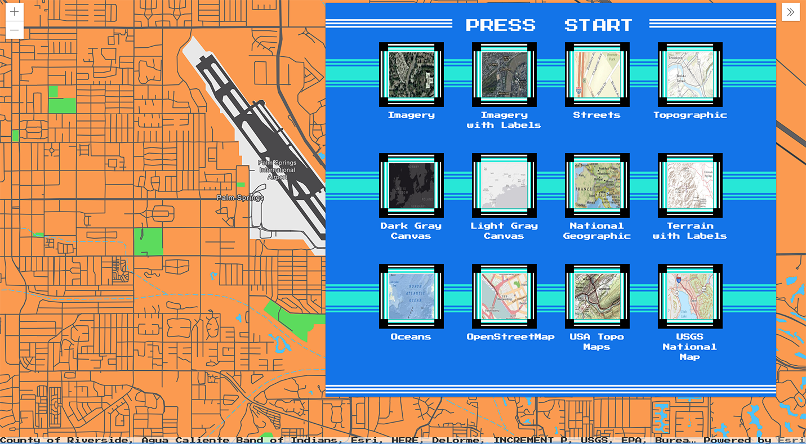

<!-- .slide: data-background="img/bg-1.png" -->
<!-- Presenter: Matt -->

# ArcGIS API for JavaScript: Customizing Widgets

### Alan Sangma – [@alansangma](https://twitter.com/alansangma)
### Matt Driscoll – [@driskull](https://twitter.com/driskull)
### JC Franco – [@arfncode](https://twitter.com/arfncode)

---

# Agenda

- What can be customized
- Customization approaches with demos
- Q & A

---

# Customizing Widgets

- Theming <!-- .element: class="fragment" data-fragment-index="1" -->
  - Changing styles: colors, sizing, font, etc.
- Implementing widget in a different framework <!-- .element: class="fragment" data-fragment-index="2" -->
- Altering presentation of a widget <!-- .element: class="fragment" data-fragment-index="3" -->

---

# Customization Approaches

- Authoring a theme <!-- .element: class="fragment" data-fragment-index="1" -->
- Recreating a view <!-- .element: class="fragment" data-fragment-index="2" -->
- Extending a view  <!-- .element: class="fragment" data-fragment-index="3" -->

---

# Ready?


---

<!-- Presenter: Alan -->
<h1 class="eight-bit">Level I</h1>


<h2 class="eight-bit">Theming</h2>

---

# Level I: Theming
## Why Theme?                                  <!-- .element: class="fragment" data-fragment-index="0" -->
- Match branding.                              <!-- .element: class="fragment" data-fragment-index="1" -->
- Match the map.                         <!-- .element: class="fragment" data-fragment-index="2" -->
- Contrast with the map.                 <!-- .element: class="fragment" data-fragment-index="3" -->
- Based on the environment.              <!-- .element: class="fragment" data-fragment-index="4" -->
- User-specific (e.g. bigger buttons)   <!-- .element: class="fragment" data-fragment-index="5" -->

---

# Theming Technology

---

We use


### to create our CSS.
<!-- .element: class="fragment" data-fragment-index="1" -->
<!-- .element: class="fragment" data-fragment-index="1" -->

<small><a href="https://nodejs.org/">nodejs.org</a> | <a href="https://gruntjs.com/">gruntjs.com</a></small><!-- .element: class="fragment" data-fragment-index="1" -->

---


### is a powerful scripting language for compiling CSS.

- It's modular.                       <!-- .element: class="fragment" data-fragment-index="1" -->
- It's DRY.                           <!-- .element: class="fragment" data-fragment-index="2" -->
- It makes theming easy.              <!-- .element: class="fragment" data-fragment-index="3" -->

---

<h3 style="font-family:monospace;text-transform:uppercase;">Previously on Theming</h3>
<span style="font-family:monospace;text-transform:uppercase;">Life was hard.</span> <!-- .element: class="fragment" data-fragment-index="1" -->

---

Before, you needed to
1. Pull down the API <a href="https://github.com/Esri/arcgis-js-api/tree/4master">(arcgis-js-api)</a>.
1. Create a theme directory in the right place.
1. Create a Sass file.
1. Import the core file.
1. Run the compiler.
1. Wonder if there were an easier way. <!-- .element: class="fragment" data-fragment-index="1" -->

---

# There is an easier way!

1. Get our theme utility. <!-- .element: class="fragment" data-fragment-index="1" -->
1. Use the utility. <!-- .element: class="fragment" data-fragment-index="2" -->
1. Customize your theme. <!-- .element: class="fragment" data-fragment-index="3" -->


---

# There is an easier way!

1. Fork the utility `jsapi-styles.git`
1. Run `npm install`
1. Edit `sass/my-theme/main.scss`.

---

# Step 1
Fork the repo.<br/>
<a href="https://github.com/jcfranco/jsapi-styles" target="_blank">https://github.com/jcfranco/jsapi-styles</a>

<div>
Clone your fork.
```
git clone https://github.com/[your-username]/interactive-design.git
```
</div><!-- .element: class="fragment" data-fragment-index="1" -->

---

# Step 2
`npm install`

<div>
  - Installs the necessary bits.
  - Creates a sample theme directory.
  - Compiles the CSS from the SCSS.
  - Spins up a preview in your default browser.
</div><!-- .element: class="fragment" data-fragment-index="1" -->

---

# Step 3
Edit your theme.<br/>
`sass/my-theme/main.scss`

<div>
Optionally, edit your app.<br/>
`preview/index.html`
</div><!-- .element: class="fragment" data-fragment-index="1" -->

---

# Let's have a look!

---

# Theme Smart
Avoid adding additional CSS selectors.<br/>
Instead, use Sass to your advantage.<br/>
<span>Let's look at how the core theme is structured.</span><!-- .element: class="fragment" data-fragment-index="1" -->

---

# Theme Structure

- Color <span>: `colorVariables.scss`</span><!-- .element: class="fragment" data-fragment-index="1" -->
- Size <span>: `sizes.scss`</span><!-- .element: class="fragment" data-fragment-index="1" -->
- Type <span>: `type.scss`</span><!-- .element: class="fragment" data-fragment-index="1" -->

---

# Theme Structure

### Default
```
// Inside base/_colorVariables.scss
$background_color : #fff !default ;
```

Any value assignment overrides the `!default` value.

```
// Inside sass/my-theme/main.scss
$background_color : #cc4b09;
```

But wait...there's more!

---

# Theme Structure

Override the four main color variables...

```
$text_color            : #fff;    // white
$background_color      : #cc4b09; // mario
$anchor_color          : #ffbaaa; // luigi
$button_text_color     : #ffbaaa; // luigi
```

<span>...then magic!</span><!-- .element: class="fragment" data-fragment-index="1" -->

<!-- .element: class="fragment" data-fragment-index="1" -->

---

# Magic


```
  $button_text_hover_color: offset-foreground-color($button_text_color, 25%) !default;
  $anchor_hover_color: offset-foreground-color($anchor_color, 25%) !default;
  $background_hover_color: offset-background-color($background_color, 5%) !default;
// etc.
```
<a href="https://developers.arcgis.com/javascript/latest/guide/styling/index.html#sassy-widgets" target="_blank">Theming Guide</a>

---

# So let's make a theme!

---

# Level I: Theming Recap

* Use the utility for easy theming. <!-- .element: class="fragment" data-fragment-index="1" -->
* Theme structure <!-- .element: class="fragment" data-fragment-index="2" -->
  - Color         <!-- .element: class="fragment" data-fragment-index="2" -->
  - Size          <!-- .element: class="fragment" data-fragment-index="2" -->
  - Typography    <!-- .element: class="fragment" data-fragment-index="2" -->
* Use the core and override values. <!-- .element: class="fragment" data-fragment-index="3" -->

---

<!-- LEVEL UP A -->
<h1 class="eight-bit">LEVEL UP!</h1>


<h2 class="eight-bit">Ready?</h2>

---

<!-- LEVEL UP B -->
<h1 class="eight-bit">LEVEL II</h1>


<h2 class="eight-bit">Views</h2>

---

<!-- Presenter: Matt -->
# Level II: Widget Composition

Widgets are composed of Views & ViewModels <!-- .element: class="fragment" data-fragment-index="0" -->

  - Reusable                  <!-- .element: class="fragment" data-fragment-index="1" -->
  - UI replacement            <!-- .element: class="fragment" data-fragment-index="2" -->
  - Framework integration     <!-- .element: class="fragment" data-fragment-index="3" -->

---

# Level II: Views

- Presentation of the Widget              <!-- .element: class="fragment" data-fragment-index="1" -->
- Uses ViewModel APIs to render the UI    <!-- .element: class="fragment" data-fragment-index="2" -->
- View-specific logic resides here        <!-- .element: class="fragment" data-fragment-index="3" -->

---

# Level II: Working with Views

<!-- .element: class="fragment" data-fragment-index="1" --> API Exploration

- <!-- .element: class="fragment" data-fragment-index="1" --> [Attribution Doc](https://developers.arcgis.com/javascript/latest/api-reference/esri-widgets-Attribution.html)
- <!-- .element: class="fragment" data-fragment-index="1" --> [Attribution.tsx](https://github.com/Esri/arcgis-js-api/blob/4master/widgets/Attribution.tsx) (View)
- <!-- .element: class="fragment" data-fragment-index="1" --> [Attribution.scss](https://github.com/Esri/arcgis-js-api/blob/4master/themes/base/widgets/_Attribution.scss) (Theme)
- <!-- .element: class="fragment" data-fragment-index="1" --> [Attribution Sample](https://developers.arcgis.com/javascript/latest/sample-code/widgets-layerlist/index.html)

---

# Views: Let's customize!

<!-- .element: class="fragment" data-fragment-index="1" --> Lets create a custom widget view.

---

# Demo

Create a custom Attribution Table view

- [Demo Steps](https://github.com/jcfranco/dev-summit-2018-customizing-widgets/tree/master/demos/custom-attribution-start/steps)
- [Demo](../demos/custom-attribution-start/)

[](https://jcfranco.github.io/dev-summit-2018-customizing-widgets/demos/custom-attribution-complete/)

<!-- .slide: data-background="img/bg-2.png" -->

---

# Level II: Views Recap

What have we learned about Widget Views? <!-- .element: class="fragment" data-fragment-index="0" -->

- Views <!-- .element: class="fragment" data-fragment-index="1" -->
  - Face of the widget <!-- .element: class="fragment" data-fragment-index="2" -->
  - Renders the viewModel brains <!-- .element: class="fragment" data-fragment-index="3" -->
  - View separation allows framework integration <!-- .element: class="fragment" data-fragment-index="4" -->
  - Views can be downloaded on API docs <!-- .element: class="fragment" data-fragment-index="5" -->
  - Can create views in other frameworks using ViewModels <!-- .element: class="fragment" data-fragment-index="6" -->

---

<!-- LEVEL UP A -->
<h1 class="eight-bit">LEVEL UP!</h1>


<h2 class="eight-bit">Ready?</h2>

---

<!-- LEVEL UP B -->
<h1 class="eight-bit">LEVEL III</h1>


<h2 class="eight-bit">Extending a View</h2>

---

<!-- Presenter: JC -->
# Level III: Extending a View

- Why?                          <!-- .element: class="fragment" data-fragment-index="1" -->
  - Reusable                    <!-- .element: class="fragment" data-fragment-index="2" -->
  - Same ecosystem              <!-- .element: class="fragment" data-fragment-index="3" -->
- How?                          <!-- .element: class="fragment" data-fragment-index="4" -->
  - JS API v4.7                 <!-- .element: class="fragment" data-fragment-index="5" -->
  - <!-- .element: class="fragment" data-fragment-index="5" --> `esri/widgets/Widget`
  - TypeScript                  <!-- .element: class="fragment" data-fragment-index="5" -->

---

`esri/widgets/Widget`

- Provides lifecycle            <!-- .element: class="fragment" data-fragment-index="1" -->
- API consistency               <!-- .element: class="fragment" data-fragment-index="2" -->

---

# Lifecycle

- <!-- .element: class="fragment" data-fragment-index="1" --> `constructor`
- <!-- .element: class="fragment" data-fragment-index="2" --> `postInitialize`
- <!-- .element: class="fragment" data-fragment-index="3" --> `render`
- <!-- .element: class="fragment" data-fragment-index="4" --> `destroy`

---

# `render`

- Defines UI                <!-- .element: class="fragment" data-fragment-index="1" -->
- Reacts to state           <!-- .element: class="fragment" data-fragment-index="2" -->
- Uses JSX                  <!-- .element: class="fragment" data-fragment-index="3" -->
- VDOM                      <!-- .element: class="fragment" data-fragment-index="4" -->

---

# TypeScript

- Typed JavaScript          <!-- .element: class="fragment" data-fragment-index="1" -->
- JS of the future, now     <!-- .element: class="fragment" data-fragment-index="2" -->
- IDE support               <!-- .element: class="fragment" data-fragment-index="3" -->
  - Visual Studio           <!-- .element: class="fragment" data-fragment-index="3" -->
  - WebStorm                <!-- .element: class="fragment" data-fragment-index="3" -->
  - Sublime                 <!-- .element: class="fragment" data-fragment-index="3" -->
  - and more!               <!-- .element: class="fragment" data-fragment-index="3" -->

---

# Demo: Extending a View

[Demo](https://jcfranco.github.io/dev-summit-2018-customizing-widgets/demos/custombasemapgallery-end/)
|
[Steps](https://github.com/jcfranco/dev-summit-2018-customizing-widgets/blob/master/demos/custombasemapgallery-start/STEPS.md)



<!-- .slide: data-background="img/bg-2.png" -->

---

# Level III: Extending a View Recap

- Reusable                          <!-- .element: class="fragment" data-fragment-index="1" -->
  - View/ViewModel                  <!-- .element: class="fragment" data-fragment-index="1" -->
- Same ecosystem                    <!-- .element: class="fragment" data-fragment-index="2" -->
  - No extra libraries              <!-- .element: class="fragment" data-fragment-index="2" -->
- Extended existing widget          <!-- .element: class="fragment" data-fragment-index="3" -->
  - Lifecycle                       <!-- .element: class="fragment" data-fragment-index="3" -->
  - TypeScript                      <!-- .element: class="fragment" data-fragment-index="3" -->

---

<!-- LEVEL UP A -->
<h1 class="eight-bit">LEVEL UP!</h1>


<h2 class="eight-bit">Ready?</h2>

---

<!-- LEVEL UP B -->
<h1 class="eight-bit">LEVEL IV</h1>


<h2 class="eight-bit">Put it all together.</h2>

---

# Conclusion

- Authored a theme      <!-- .element: class="fragment" data-fragment-index="1" -->
- Recreated a view      <!-- .element: class="fragment" data-fragment-index="2" -->
- Extended a view       <!-- .element: class="fragment" data-fragment-index="3" -->

---

## Additional Resources

- [Implementing Accessor](https://developers.arcgis.com/javascript/latest/guide/implementing-accessor/index.html)
- [Setting up TypeScript](https://developers.arcgis.com/javascript/latest/guide/typescript-setup/index.html)
- [Widget Development](https://developers.arcgis.com/javascript/latest/guide/custom-widget/index.html)
- [JS API SDK](https://developers.arcgis.com/javascript/)

---

# Questions?

##### For example

> &#x1f914; Where can I find the slides/source?

&#x1F449; [esriurl.com/customwidgetsds2018](http://esriurl.com/customwidgetsds2018) &#x1F448;

---

<!-- **please rate us** -->
<!-- .slide: data-background="img/ds18-survey.png" -->

---

<!-- .slide: data-background="img/bg-final.jpg" -->


---

<!-- .slide: data-background="img/bg-final.jpg" -->
