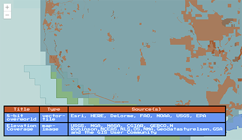

<!-- .slide: data-background="images/start-background.png" -->
<!-- Presenter: Matt -->

# ArcGIS API for JavaScript: Customizing Widgets

### Alan Sangma – [@alansangma](https://twitter.com/alansangma)
### Matt Driscoll – [@driskull](https://twitter.com/driskull)
### JC Franco – [@arfncode](https://twitter.com/arfncode)

---

# Agenda

- What can be customized
- Customization approaches with demos
- Q & A

---

# Customizing Widgets

- Theming <!-- .element: class="fragment" data-fragment-index="1" -->
  - Changing styles: colors, sizing, font, etc.
- Implementing widget in a different framework <!-- .element: class="fragment" data-fragment-index="2" -->
- Altering presentation of a widget <!-- .element: class="fragment" data-fragment-index="3" -->

---

# Customization Approaches

- Authoring a theme <!-- .element: class="fragment" data-fragment-index="1" -->
- Recreating a view <!-- .element: class="fragment" data-fragment-index="2" -->
- Extending a view  <!-- .element: class="fragment" data-fragment-index="3" -->

---

# Ready?


---

<!-- Presenter: Alan -->
<h1 class="eight-bit">Level I</h1>


<h2 class="eight-bit">Theming</h2>

---

# Level I: Theming
## Why Theme?                                  <!-- .element: class="fragment" data-fragment-index="0" -->
- Match branding.                              <!-- .element: class="fragment" data-fragment-index="1" -->
- Match the map.                         <!-- .element: class="fragment" data-fragment-index="2" -->
- Contrast with the map.                 <!-- .element: class="fragment" data-fragment-index="3" -->
- Based on the environment.              <!-- .element: class="fragment" data-fragment-index="4" -->
- User-specific (e.g. bigger buttons)   <!-- .element: class="fragment" data-fragment-index="5" -->

---


#### A powerful scripting language for producing CSS.


---


### Why Sass?
- It's modular.                       <!-- .element: class="fragment" data-fragment-index="1" -->
- It's DRY.                           <!-- .element: class="fragment" data-fragment-index="2" -->
- It makes theming easy.              <!-- .element: class="fragment" data-fragment-index="3" -->

---


### Compiling


<!-- .element: class="fragment" data-fragment-index="4" -->

---

# Let's Create a Theme!

1. Create your theme directory. <!-- .element: class="fragment" data-fragment-index="5" -->
  -   `esri/themes/[your-theme-name]/`
1. Create a Sass file in your theme directory. <!-- .element: class="fragment" data-fragment-index="6" -->
  - `main.scss`
  - `@import "../base/core";`
1. Compile. <!-- .element: class="fragment" data-fragment-index="7" -->
1. Include the compiled CSS in your app. <!-- .element: class="fragment" data-fragment-index="8" -->

<div>
```
  <!-- in your app -->
  <link rel="stylesheet" href="esri/themes/[your-theme-name]/main.css">
```
</div> <!-- .element: class="fragment" data-fragment-index="8" -->

---

# Theme Structure
Avoid writing a bunch of CSS selectors.

<div>Include the theme "core" and override the default values.</div><!-- .element: class="fragment" data-fragment-index="1" -->

---

# Theme Structure

The theme core brings in three main **variable** files:
- `base/_colorVariables.scss`
- `base/_sizes.scss`
- `base/_type.scss`

These set the **default** values.

---

# Theme Structure

### Default
```
// Inside base/_colorVariables.scss
$background_color : #fff !default ;
```

Any value assignment overrides the `!default` value.

```
// Inside esri/themes/[your-theme-name]/main.scss
$background_color : #cc4b09;
```

But wait...there's more!

---

# Theme Structure

Override the four main color variables...

```
$text_color            : #fff;    // white
$background_color      : #cc4b09; // mario
$anchor_color          : #ffbaaa; // luigi
$button_text_color     : #ffbaaa; // luigi
```

_...then magic!_   <!-- .element: class="fragment" data-fragment-index="1" -->

  <!-- .element: class="fragment" data-fragment-index="1" -->

<a href="https://developers.arcgis.com/javascript/latest/guide/styling/index.html#sassy-widgets" target="_blank">Theming Guide</a> <!-- .element: class="fragment" data-fragment-index="2" -->

---

# Demo: Theming

<!-- .slide: data-background="images/demo-background.png" -->

<a target="_blank" href="http://localhost/jcfranco/dev-summit-2018-customizing-widgets/demos/theming/"></a>

---

# Level I: Theming Recap

* Use Sass for easy theming. <!-- .element: class="fragment" data-fragment-index="1" -->
* Theme structure <!-- .element: class="fragment" data-fragment-index="2" -->
  - Color         <!-- .element: class="fragment" data-fragment-index="2" -->
  - Size          <!-- .element: class="fragment" data-fragment-index="2" -->
  - Typography    <!-- .element: class="fragment" data-fragment-index="2" -->
* Use the core and override values. <!-- .element: class="fragment" data-fragment-index="3" -->

---

<!-- LEVEL UP A -->
<h1 class="eight-bit">LEVEL UP!</h1>


---

<!-- LEVEL UP B -->
<h1 class="eight-bit">LEVEL II</h1>


<h2 class="eight-bit">Views</h2>

---

<!-- Presenter: Matt -->
# Level II: Widget Composition

Widgets are composed of Views & ViewModels <!-- .element: class="fragment" data-fragment-index="0" -->

  - Reusable                  <!-- .element: class="fragment" data-fragment-index="1" -->
  - UI replacement            <!-- .element: class="fragment" data-fragment-index="2" -->
  - Framework integration     <!-- .element: class="fragment" data-fragment-index="3" -->

---

# Level II: Views

- Presentation of the Widget              <!-- .element: class="fragment" data-fragment-index="1" -->
- Uses ViewModel APIs to render the UI    <!-- .element: class="fragment" data-fragment-index="2" -->
- View-specific logic resides here        <!-- .element: class="fragment" data-fragment-index="3" -->

---

# Level II: Working with Views

<!-- .element: class="fragment" data-fragment-index="1" --> API Exploration

- <!-- .element: class="fragment" data-fragment-index="1" --> [LayerList Doc](https://developers.arcgis.com/javascript/latest/api-reference/esri-widgets-LayerList.html)
- <!-- .element: class="fragment" data-fragment-index="1" --> [LayerList.tsx](https://github.com/Esri/arcgis-js-api/blob/4master/widgets/LayerList.tsx) (View)
- <!-- .element: class="fragment" data-fragment-index="1" --> [LayerList.scss](https://github.com/Esri/arcgis-js-api/blob/4master/themes/base/widgets/_LayerList.scss) (Theme)
- <!-- .element: class="fragment" data-fragment-index="1" --> [LayerList Sample](https://developers.arcgis.com/javascript/latest/sample-code/widgets-layerlist/index.html)

---

# Views: Let's customize!

<!-- .element: class="fragment" data-fragment-index="1" --> Lets create a custom widget view.

<!-- .element: class="fragment" data-fragment-index="2" --> Using...

- <!-- .element: class="fragment" data-fragment-index="2" --> [jQuery](https://jquery.com/)
  - <!-- .element: class="fragment" data-fragment-index="2" --> [Plugin creation](https://learn.jquery.com/plugins/basic-plugin-creation/)
- <!-- .element: class="fragment" data-fragment-index="2" --> [Bootstrap](http://getbootstrap.com/)

---

# Demo

Create a custom LayerList view for a Bootstrap app

- [Demo Steps](https://github.com/jcfranco/dev-summit-2018-customizing-widgets/blob/master/demos/layerlist-steps.md)
- [Demo](../demos/customlayerlist-start/)

[](https://jcfranco.github.io/dev-summit-2018-customizing-widgets/demos/customlayerlist-complete/)

<!-- .slide: data-background="images/demo-background.png" -->

---

# Level II: Views Recap

What have we learned about Widget Views? <!-- .element: class="fragment" data-fragment-index="0" -->

- Views <!-- .element: class="fragment" data-fragment-index="1" -->
  - Face of the widget <!-- .element: class="fragment" data-fragment-index="2" -->
  - Renders the viewModel brains <!-- .element: class="fragment" data-fragment-index="3" -->
  - View separation allows framework integration <!-- .element: class="fragment" data-fragment-index="4" -->
  - Views can be downloaded on API docs <!-- .element: class="fragment" data-fragment-index="5" -->
  - Can create views in other frameworks using ViewModels <!-- .element: class="fragment" data-fragment-index="6" -->

---

<!-- LEVEL UP A -->
<h1 class="eight-bit">LEVEL UP!</h1>


---

<!-- LEVEL UP B -->
<h1 class="eight-bit">LEVEL III</h1>


<h2 class="eight-bit">Extending a View</h2>

---

<!-- Presenter: JC -->
# Level III: Extending a View

- Why?                          <!-- .element: class="fragment" data-fragment-index="1" -->
  - Reusable                    <!-- .element: class="fragment" data-fragment-index="2" -->
  - Same ecosystem              <!-- .element: class="fragment" data-fragment-index="3" -->
- How?                          <!-- .element: class="fragment" data-fragment-index="4" -->
  - JS API v4.4                 <!-- .element: class="fragment" data-fragment-index="5" -->
  - esri/widgets/Widget         <!-- .element: class="fragment" data-fragment-index="5" -->
  - TypeScript                  <!-- .element: class="fragment" data-fragment-index="5" -->

---

`esri/widgets/Widget`

- Provides lifecycle            <!-- .element: class="fragment" data-fragment-index="1" -->
- API consistency               <!-- .element: class="fragment" data-fragment-index="2" -->

---

# Lifecycle

- constructor         <!-- .element: class="fragment" data-fragment-index="1" -->
- postInitialize      <!-- .element: class="fragment" data-fragment-index="2" -->
- render              <!-- .element: class="fragment" data-fragment-index="3" -->
- destroy             <!-- .element: class="fragment" data-fragment-index="8" -->

---

# `render`

- Defines UI                <!-- .element: class="fragment" data-fragment-index="1" -->
- Reacts to state           <!-- .element: class="fragment" data-fragment-index="2" -->
- Uses JSX                  <!-- .element: class="fragment" data-fragment-index="3" -->

```js
render() {
  const x = Number(x).toFixed(3);
  const y = Number(y).toFixed(3);
  const scale = Number(scale).toFixed(5);

  return (
    <div bind={this} class={CSS.base} onclick={this._handleClick}>
      <p>x: {x}</p>
      <p>y: {y}</p>
      <p>scale: {scale}</p>
    </div>
  );
}
```
<!-- .element: class="fragment current-visible" data-fragment-index="4" -->

---

# TypeScript

- Typed JavaScript          <!-- .element: class="fragment" data-fragment-index="1" -->
- JS of the future, now     <!-- .element: class="fragment" data-fragment-index="2" -->
- IDE support               <!-- .element: class="fragment" data-fragment-index="3" -->
  - Visual Studio           <!-- .element: class="fragment" data-fragment-index="3" -->
  - WebStorm                <!-- .element: class="fragment" data-fragment-index="3" -->
  - Sublime                 <!-- .element: class="fragment" data-fragment-index="3" -->
  - and more!               <!-- .element: class="fragment" data-fragment-index="3" -->

---

# Demo: Extending a View

[Demo](https://jcfranco.github.io/dev-summit-2018-customizing-widgets/demos/custombasemapgallery-end/)
[Steps](https://github.com/jcfranco/dev-summit-2018-customizing-widgets/blob/master/demos/custombasemapgallery-start/STEPS.md)


<!-- .slide: data-background="images/demo-background.png" -->

---

# Level III: Extending a View Recap

- Reusable                          <!-- .element: class="fragment" data-fragment-index="1" -->
  - View/ViewModel                  <!-- .element: class="fragment" data-fragment-index="1" -->
- Same ecosystem                    <!-- .element: class="fragment" data-fragment-index="2" -->
  - No extra libraries              <!-- .element: class="fragment" data-fragment-index="2" -->
- Extended existing widget          <!-- .element: class="fragment" data-fragment-index="3" -->
  - Lifecycle                       <!-- .element: class="fragment" data-fragment-index="3" -->
  - TypeScript                      <!-- .element: class="fragment" data-fragment-index="3" -->

---

<!-- LEVEL UP A -->
<h1 class="eight-bit">LEVEL UP!</h1>


---

<!-- LEVEL UP B -->
<h1 class="eight-bit">LEVEL IV</h1>


<p class="eight-bit">Put it all together.</p>

---

# Conclusion

- Authored a theme      <!-- .element: class="fragment" data-fragment-index="1" -->
- Recreated a view      <!-- .element: class="fragment" data-fragment-index="2" -->
- Extended a view       <!-- .element: class="fragment" data-fragment-index="3" -->

---

## Additional Resources

- [Implementing Accessor](https://developers.arcgis.com/javascript/latest/guide/implementing-accessor/index.html)
- [Setting up TypeScript](https://developers.arcgis.com/javascript/latest/guide/typescript-setup/index.html)
- [Widget Development](https://developers.arcgis.com/javascript/latest/guide/custom-widget/index.html)
- [JS API SDK](https://developers.arcgis.com/javascript/)

---

# The source code!

## [esriurl.com/customwidgetsds2018](http://esriurl.com/customwidgetsds2018)

---

<!-- .slide: data-background="images/survey-background.png" -->

---

# Questions?


---


---

<!-- .slide: data-background="images/end-background.png" -->
